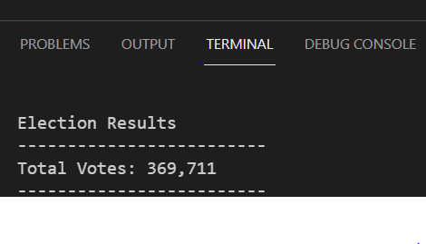
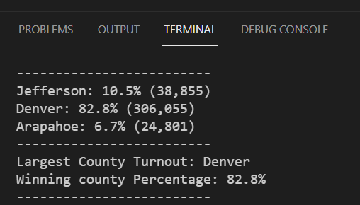
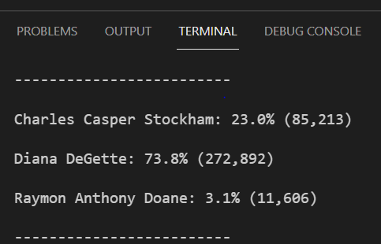
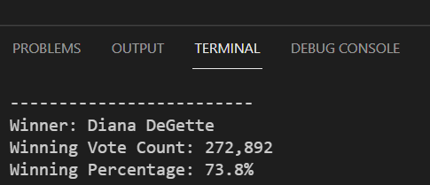

# Election_Analysis

## Overview of Election Audit
Seth and Tom would like to analyze the election data and submit the election audit results to the election commission, Colorado Board of Elections.  
 
### Purpose
The purpose of the project was to analyze the voter turnout of each county, the percentage of votes from each county out of the total count and the county with the highest turnout.  
 
### Analysis and outcomes 
Election data were analyzed using repetition and conditional statements with logical operators by Python Software (3.7.6) in Visual Studio code 1.61.0.   

### Election output saved to a text file  

  

## Deliverable 1.

### 1. Total Votes in the election are printed to the terminal (attched in PNG file)

  with open(file_to_save, "w") as txt_file:

  ## Print the final vote count (to terminal)
    election_results = (
        f"\nElection Results\n"
        f"-------------------------\n"
        f"Total Votes: {total_votes:,}\n"
        f"-------------------------\n")
    print(election_results, end="")

    txt_file.write(election_results)

### TERMINAL 

#### 2. Each candidates total votes, percentage of the vote, winner of the    election, winning vote count, and winning percentage of votes.

###  Retrieve vote count and percentage 
        candidate_vote = candidate_votes[candidate_name]
        vote_percentage = float(candidate_vote) / float(total_votes) * 100
        candidate_results = (
            f"{candidate_name}: {vote_percentage:.1f}% ({candidate_vote:,})\n")
 ### Print each candidate's voter count and percentage to the terminal 
        print(candidate_results)
#### Save the candidates results to the text fiel 
        txt_file.write(candidate_results)

#### Determine winning vote count, winning percentage, and winning candidate.
        if (candidate_vote > winning_count) and (vote_percentage > winning_percentage):
            winning_count = candidate_vote
            winning_candidate = candidate_name
            winning_percentage = vote_percentage
    
#### Print the winning candidate's results to the terminal.
    winning_candidate_summary = (
        f"-------------------------\n"
        f"Winner: {winning_candidate}\n"
        f"Winning Vote Count: {winning_count:,}\n"
        f"Winning Percentage: {winning_percentage:.1f}%\n"
        f"-------------------------\n")
    print(winning_candidate_summary)
#### Save the winning candidate's results to the text file.
    txt_file.write(winning_candidate_summary)

#### TERMINAL 

## Deriverable 2: Election Results Saved to a Text File (Terminal attached in PNG file).

##### A. Each county and its's total vote count, each county and it's percentage of the total votes, and county with the largest number of voters 

###### 6a: Write a for loop to get the county from the county dictionary.
 
    for county_name in county_votes:
###### 6b: Retrieve the county vote count.
        county_vote = county_votes[county_name]
###### 6c: Calculate the percentage of votes for the county.
        county_percentage = float(county_vote) / float(total_votes) * 100
        county_results = (
            f"{county_name}: {county_percentage:.1f}% ({county_vote:,})\n")

###### 6d: Print the county results to the terminal.
        print(county_results, end="")
        # 6e: Save the county votes to a text file.
        txt_file.write(county_results)
  
    for candidate_name in candidate_votes:

#### B. Script for county with the largest turnout  

###### 6f: Write an if statement to determine the winning county and get its vote count.
        if (county_vote > largest_county_vote):
            Largest_county_turnout = county_name
            largest_county_vote = county_vote
            winning_county_percentage = county_percentage

#### 7: Print the county with the largest turnout to the terminal.
    winning_county_summary = (
        f"-------------------------\n"
        f"Largest County Turnout: {Largest_county_turnout}\n"
        f"Winning county Percentage: {winning_county_percentage:.1f}%\n"
        f"-------------------------\n")
    print(winning_county_summary)

#### 8: Save the county with the largest turnout to a text file.
    txt_file.write(winning_county_summary)

# TERMINAL 
- Please find the attched file results 

## Deliverable 3. (Overview of election audit and purpose are presented at the top)

## 2. Election-Audit Results (Attached please find the text file and python script)

  - 369,711 votes were casted in congressional election 
  - Counties; Jefferson, Denver and Arapahoe had 38,855, 306,055, 24,801 number of votes, and 10.5%, 82.8%, 6.7% percentage of votes, respectively.
  - Denver had the largest number of votes (# 306,055).
  - Candidates; Charles Casper Stockham, Diana DeGette and Raymon Anthony Doane have received 85,213, 272,892 and 
    11,606 votes, and 23.0%, 73.8%, 3.1% percentage of total votes, respectively. 
  - Diana DeGette won the election with 272,892 vote count and 73.8% total votes. 

## 3. Election-Audit Summary 

I would propose to use this script for future election performance because this python script can be used as a template for any type of elections (federal or parliamentary elections) with some modifications, and it can be a valuable resource for the board. The script can also use as a baseline to modify and analyze for petitions, games and races. The script can be modified by adding data such as gender, age, ethnicity, and party affiliation columns to analyze the age, gender and party status of the voters and candidates as well. We can also access the voting methods; Mail-In Ballot, Punch Cards and Direct Recording Electronics, example the amount of votes cast by mail vs in person. 

